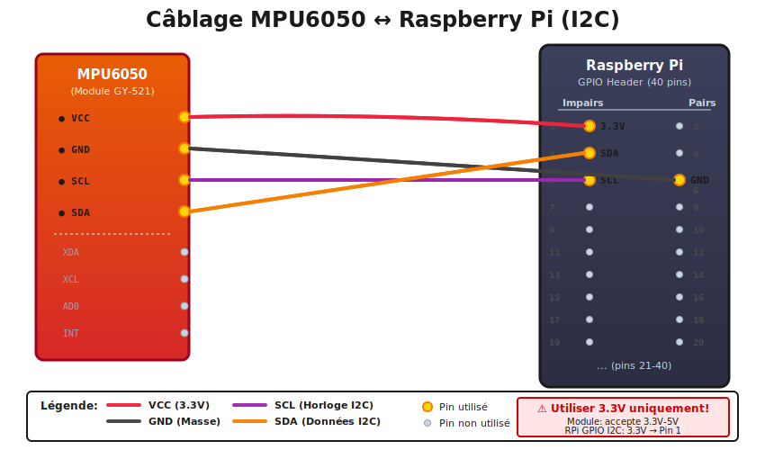

# Raspberry Pi MPU6050 Driver (Java)

Ce module fournit une bibliothèque Java robuste et performante pour interagir avec le capteur **MPU6050** (Accéléromètre + Gyroscope 6 axes) sur un Raspberry Pi. Il est construit sur la stack **Pi4J v3** (I2C) et conçu pour être facilement intégrable dans d'autres applications Java (comme des simulateurs ou robots).

## ✨ Fonctionnalités

*   🚀 **Communication I2C Native** : Utilisation de Pi4J v3 (Provider LinuxFS) pour des performances optimales.
*   ⚙️ **Configuration Flexible** : 
    *   Plages accéléromètre : ±2g, ±4g, ±8g, ±16g
    *   Plages gyroscope : ±250, ±500, ±1000, ±2000 °/s
    *   Filtre passe-bas (DLPF) numérique configurable
*   📊 **Lecture Optimisée** : Mode "Burst" (lecture en une seule transaction I2C) pour maximiser la fréquence d'échantillonnage.
*   🌡️ **Données Complètes** : Accès brut aux 3 axes d'accélération, 3 axes de rotation et à la température.

## 🛠️ Prérequis

### Matériel
*   **Raspberry Pi** (3, 4, 5 ou Zero)
*   **Capteur MPU6050** (GY-521 ou compatible)
*   **Câblage** : 4 câbles Dupont femelle-femelle

#### 🔌 Schéma de Câblage

<div align="center">
  
</div>

**Connexions I2C :**

| MPU6050 Pin | Raspberry Pi Pin | Description |
|-------------|------------------|-------------|
| VCC | Pin 1 (3.3V) | ⚠️ **Alimentation 3.3V uniquement** |
| GND | Pin 6 (GND) | Masse |
| SDA | Pin 3 (GPIO 2) | Données I2C |
| SCL | Pin 5 (GPIO 3) | Horloge I2C |

> [!IMPORTANT]
> **TENSION D'ALIMENTATION :** N'utilisez **jamais** le 5V pour alimenter le MPU6050, utilisez uniquement le **3.3V**. Le capteur n'est pas tolérant au 5V et pourrait être endommagé.

### Logiciel
*   **Java 21** (JDK) ou supérieur - requis pour Pi4J v3
*   **Maven 3.8** ou supérieur
*   **Configuration Système** : L'interface I2C doit être activée sur le Raspberry Pi (`sudo raspi-config` > Interface Options > I2C).

## 🚀 Installation et Compilation

Ce projet utilise Maven. Pour compiler et installer le driver dans votre dépôt local :

```bash
# Dans le dossier mpudriver/
mvn clean install
```

Cela va générer le fichier JAR dans le dossier `target/` :
*   `mpudriver-1.0-SNAPSHOT.jar`

## 📦 Intégration dans votre projet

Pour utiliser ce driver directement dans votre application Maven, ajoutez la dépendance suivante dans votre `pom.xml` :

```xml
<dependency>
    <groupId>fr.ensma.a3.ia</groupId>
    <artifactId>mpudriver</artifactId>
    <version>1.0-SNAPSHOT</version>
</dependency>
```

## 💻 Exemple d'Utilisation

Voici comment initialiser et lire le capteur dans votre code Java :

```java
import com.pi4j.Pi4J;
import com.pi4j.context.Context;
import fr.ensma.a3.ia.mpudriver.Mpu6050;
import fr.ensma.a3.ia.mpudriver.Mpu6050Config;
import fr.ensma.a3.ia.mpudriver.Mpu6050Data;

// ...

public class Main {
    public static void main(String[] args) {
        // 1. Créer le contexte Pi4J
        Context pi4j = Pi4J.newAutoContext();

        // 2. Initialiser le driver MPU6050 (Bus 1)
        // Utilisation de try-with-resources pour la fermeture propre
        try (Mpu6050 mpu = new Mpu6050(pi4j, 1)) {

            // (Optionnel) Configuration personnalisée ici
            
            System.out.println("Lecture du capteur MPU6050...");
            Mpu6050Data data = new Mpu6050Data();

            // 3. Boucle de lecture
            for (int i = 0; i < 100; i++) {
                mpu.readAll(data); // Lit Accel, Gyro et Temp
                
                System.out.printf("Accel: %.2fg | Gyro: %.1f°/s%n", 
                    data.getAccelX(), data.getGyroZ());
                    
                Thread.sleep(20); // ~50Hz
            }
        } catch (Exception e) {
            e.printStackTrace();
        }
    }
}
```

## 📂 Structure du Projet

Les sources principales se trouvent dans `src/main/java/fr/ensma/a3/ia/mpudriver/` :

*   `Mpu6050.java` : La classe principale du driver gérant la communication I2C.
*   `Mpu6050Config.java` : Gestion de la configuration du capteur.
*   `Mpu6050Constants.java` : Définition des constantes et registres du MPU6050.
*   `Mpu6050Data.java` : POJO (Plain Old Java Object) pour stocker les mesures brutes.