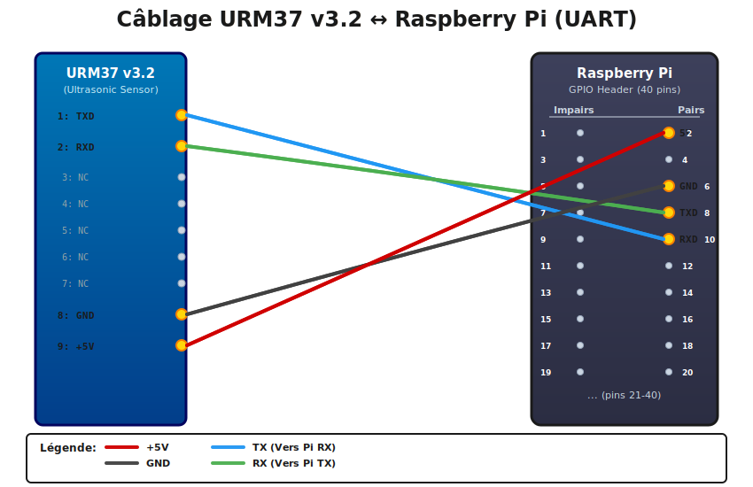

# Raspberry Pi URM37 v3.2 Driver (Java)

Ce module fournit une bibliothèque Java performante pour interagir avec le capteur ultrasonique **URM37 v3.2** via une liaison série (UART) sur un Raspberry Pi.

Contrairement aux implémentations basées sur des wrappers natifs, ce driver utilise **jSerialComm**, une solution pure Java robuste, pour une communication série fluide et efficace sans dépendances système lourdes.

## ✨ Fonctionnalités

*   📏 **Télémétrie Précise** : Mesure de distance ultrasonique (cm) fiable.
*   🌡️ **Capteur Hybride** : Lecture intégrée de la température interne (°C).
*   🚀 **Communication Série (UART)** : Utilisation de `jSerialComm` pour une gestion native et performante du port série.
*   🛡️ **Robuste & Sûr** : Gestion intégrée des timeouts, des checksums et fermeture propre des ressources (`AutoCloseable`).

## 🛠️ Prérequis

### Matériel
*   **Raspberry Pi** (3, 4, 5 ou Zero)
*   **Capteur URM37 v3.2**
*   **Câblage** : Câbles Dupont (Attention aux niveaux logiques !)

#### 🔌 Schéma de Câblage

<div align="center">
  
</div>

**Connexions UART (Mode Série TTL) :**

| URM37 Pin | Raspberry Pi Pin | Description |
|-----------|------------------|-------------|
| VCC | Pin 2 ou 4 (5V) | Alimentation (Le capteur nécessite souvent 5V) |
| GND | Pin 6 (GND) | Masse commune |
| RXD | Pin 8 (GPIO 14 - TX) | Réception du capteur (depuis le TX du Pi) |
| TXD | Pin 10 (GPIO 15 - RX) | Émission du capteur (vers le RX du Pi) |

### Logiciel
*   **Java 21** ou supérieur
*   **Maven 3.8** ou supérieur
*   **Configuration Système** :
    1.  Activer le port série : `sudo raspi-config` > Interface Options > Serial Port (Login Shell: **NO**, Hardware: **YES**).
    2.  Permissions utilisateur : Ajoutez votre utilisateur au groupe `dialout` :
        ```bash
        sudo usermod -a -G dialout $USER
        # Un redémarrage est nécessaire
        ```

## 🚀 Installation et Compilation

Ce projet utilise Maven. Pour compiler et installer le driver dans votre dépôt local :

```bash
# Dans le dossier urmdriver/
mvn clean install
```

Cela va générer le fichier JAR dans le dossier `target/` :
*   `urm37-driver-1.0-SNAPSHOT.jar`

## 📦 Intégration dans votre projet

Pour utiliser ce driver directement dans votre application Maven, ajoutez la dépendance suivante dans votre `pom.xml` :

```xml
<dependency>
    <groupId>fr.ensma.a3.ia</groupId>
    <artifactId>urm37-driver</artifactId>
    <version>1.0-SNAPSHOT</version>
</dependency>
```

## 💻 Exemple d'Utilisation

Voici comment initialiser et lire le capteur dans votre code Java :

```java
import fr.ensma.a3.ia.urmdriver.Urm37;
import fr.ensma.a3.ia.urmdriver.Urm37Data;

public class Main {
    public static void main(String[] args) {
        // Port série par défaut sur Raspberry Pi (peut varier : /dev/ttyS0, /dev/serial0)
        String portName = "/dev/ttyS0"; 

        System.out.println("Initialisation du capteur URM37 sur " + portName + "...");

        // Utilisation de try-with-resources pour la fermeture automatique du port
        try (Urm37 sensor = new Urm37(portName)) {
            
            Urm37Data data = new Urm37Data();

            // Boucle de lecture
            for (int i = 0; i < 20; i++) {
                // Lecture complète (Distance + Température)
                sensor.readAll(data);
                
                System.out.printf("Distance: %.1f cm | Temp: %.1f °C%n", 
                    data.getDistanceCm(), data.getTemperature());
                
                // Pause pour ne pas saturer le capteur (min 50ms conseillé)
                Thread.sleep(100);
            }

        } catch (Exception e) {
            System.err.println("Erreur de communication : " + e.getMessage());
            e.printStackTrace();
        }
    }
}
```

## 📂 Structure du Projet

Les sources principales se trouvent dans `src/main/java/fr/ensma/a3/ia/urmdriver/` :

*   `Urm37.java` : Classe principale gérant le protocole série (commandes, réponses).
*   `Urm37Data.java` : POJO pour stocker les mesures (distance, température).
*   `Urm37Config.java` : Classe utilitaire pour définir des profils de configuration.
*   `Urm37Constants.java` : Définition des opcodes et constantes du protocole URM37.